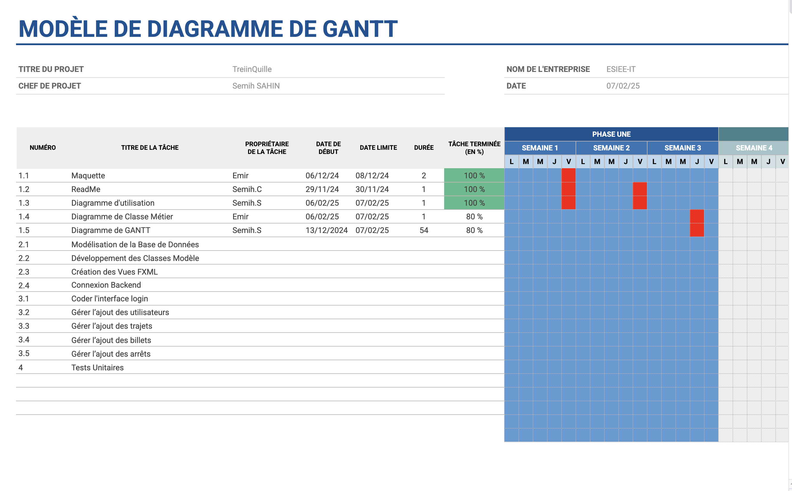

# Contexte Treiinquille
Semih Cakici, Semih Sahin, Emir Sen
2024-2025

**L'agence TempoTrain** est une entreprise spécialisée dans les voyages temporels. Grâce à ses services, les voyageurs peuvent se rendre dans différentes époques, en suivant des itinéraires sécurisés et programmés à l'avance.

L’agence garantit des trajets ponctuels et synchronisés, adaptés aux besoins des conducteurs et des passagers, tout en assurant une gestion rigoureuse du planning et du suivi des billets pour chaque voyage.

---

## Objectifs du Projet

Le projet vise à développer une application de gestion des trajets temporels de TempoTrain. Cette application permettra aux managers et conducteurs d’avoir une interface intuitive pour gérer le planning et suivre les ventes de billets, optimisant ainsi le fonctionnement de l’agence.

### Problèmes à Résoudre

1. **Gestion du Planning des Conducteurs**

   - Chaque conducteur doit savoir précisément quand, à quelle heure et pour quelle époque un voyage est prévu.
   - Le planning doit être à jour en temps réel et adaptable pour gérer des changements ou des annulations de dernière minute.

2. **Suivi des Billets et des Places Disponibles**
   - L’application doit permettre aux managers de consulter le nombre de billets vendus pour chaque voyage.
   - La gestion des places restantes doit être affichée pour chaque trajet afin d’éviter toute surcharge.

---

## Solution Proposée :+1:

### Fonctionnalités de l’Application

1. **Module de Planification des Conducteurs**

   - Création et modification du planning des conducteurs, incluant les heures de départ, la date réelle et la date d’arrivée prévue dans l’époque de destination.

2. **Suivi des Billets et des Places Disponibles**
   - Consultation du nombre de billets vendus pour chaque trajet temporel, avec une mise à jour en temps réel.
   - Indication du nombre de places restantes pour chaque voyage, permettant une gestion optimale de la capacité des trains.

---

## Utilisateurs de l’Application

- **Managers** : Pour créer, modifier et suivre les plannings et le suivi des billets.
- **Conducteurs** : Pour consulter leurs trajets, assurer la bonne gestion de chaque voyage.

---

    

# Diagramme de cas d'utilisation :

# diagramme de classes métier :

# diagramme de Gantt :

Le lien pour accèder à tous notre diagrame de Gantt
https://docs.google.com/spreadsheets/d/10rDGZLGdYxj_BTiiNsYnD3ZwOknBP7Kthplk6Bj9mUo/edit?usp=sharing

# maquette :

https://github.com/Semiiih/Treiinquille/blob/main/maquette.pdf